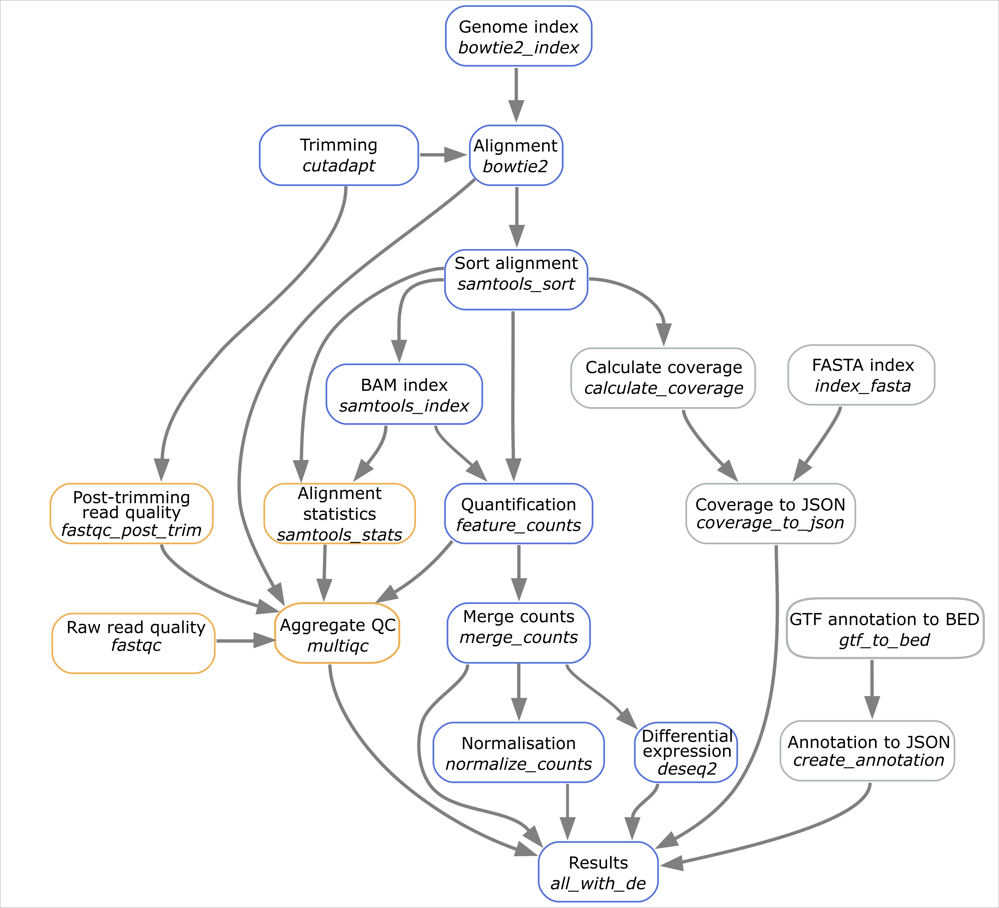

# Snakemake RNA-seq: Bacterial timecourse RNA-Seq workflow
## Introduction
Author: Anže Lovše (@AnzeLovse)


This is a Snakemake workflow for generating gene expression counts from RNA-sequencing data and can optionally be used to run differential expression analysis as well. The workflow handles both single-end and paired-end sequencing data. We used the workflow for analyzing sequencing data from Bacillus thuringiensis serovar israelensis as a part of my bachelor thesis.

If you use this workflow in a paper, don't forget to give credits to the authors by citing the URL of this (original) repository.

## Overview
The standard workflow performs the following steps:
1. Trim reads with Cutadapt.
2. Build a genome index and align reads with Bowtie2.
3. Sort and index reads with Samtools.
4. Generate gene expression counts with featureCounts.
5. Merge all counts into a single file.
6. Normalize counts (CPM, TPM) with rnanorm
7. (optionally) Differential expression with DESeq2

Additionally the workflow includes quality control steps:
- Read quality reports before and after trimming using FASTQC.
- Read alignment statistics based on Samtools and Bowtie2 reports.
- featureCounts statistics report.
- Aggregated report made with MultiQC

and visualization helper functions:
- Genome coverage made with genomeCoverageBed.
- Calculate FASTA index.
- Create JSON file with coverage data.
- Convert GTF to BED.
- Generate JSON file containing genomic features.

Steps are shown in the following graph. Each rectangle represents a step of the analysis. Names of the rules are written in italic. Blue rectangles represent main steps, yellow ones show QC steps and the gray ones represent helper functions.


## How to use

### Prerequisites
Download Docker or install Miniconda. If you use Miniconda choose Python 3.8 (or higher) for your operating system and follow the installation instructions.

    conda --version # ideally 4.9.xx or higher
    python --version # ideally 3.8.xx or higher

### Step 1: Obtain a copy of this workflow

If you simply want to use this workflow, download and extract the latest release or clone it with:


    git clone https://github.com/AnzeLovse/mag.git


If you intend to modify and further develop this workflow, fork this repository. Please consider providing any generally applicable modifications via a pull request.

### Step 2: Configure workflow

Configure the workflow according to your needs via editing the files in the `config/` folder. Adjust `config.yaml` to configure the workflow execution, `samples.tsv` to specify your experiment setup and `units.tsv` to specify sequencing runs.

### Step 3: Pull Docker image (recommended) or create Conda environment

For Docker image pull the latest (currently 0.1.5) image from Docker Hub:

    docker pull alovse/rnaseq-mag
---
Conda environment only supports quantification and not differential expressions.
To set it up use:

    conda install -y -c conda-forge mamba
    mamba create -q -y -c conda-forge -c bioconda -n snakemake snakemake python=3.8
    conda env update -n snakemake --file /var/cache/build/environment.yaml
    conda run -n snakemake python -m pip install rnanorm

### Step 4: Execute workflow

Create a results directory and copy the configuration in it:

    mkdir results_timecourse # create the directory
    cp config results_timecourse # copy the configuration

Transfer reference genomes and reads into a subdirectory of results directory. The results directory should follow this structure. Please note that `0.72.0/bio/fastqc` wrapper only supports `.fastq` files and not `.fq` files.
```bash
├── config
│   ├── config.yaml
│   ├── samples.tsv
│   └── units.tsv
├── data
│   ├── reference.fasta
│   ├── annotation.gtf
│   └── reads.fastq
```
To run the workflow with Docker use:

    cd mag # open the directory
    docker run -m `$M` -v $(pwd):/data mag:latest bin/bash -c "source activate snakemake; cd data; snakemake --cores `$N` `$STEP`"

using `$N` cores, `$M` of memory and the desired step `$STEP` (e.g. `all` or `all_with_de`)

---
Alternatively you can use Conda.

Activate the conda environment:

    conda activate snakemake

Test your configuration by performing a dry-run via

    snakemake -n all

Execute the workflow locally via

    snakemake --cores $N all

using `$N` cores and choosing the desired `$STEP` (e.g. `all` or `all_with_de`)

See the [Snakemake documentation](https://snakemake.readthedocs.io/en/stable/executable.html) for further details.

### Step 5: Investigate results

After successful execution, you can inspect the interactive HTML report made with MultiQC. It is located in `results_timecourse/qc/multiqc.html`

For more information about MultiQC please see the [official webpage](https://multiqc.info/) and tool documentation.

Directory sturcture of the results folder is shown below.
```bash
├── bedgraphs
├── config
├── counts
├── data
├── deseq2
├── index
├── logs
│   ├── bedgraphs
│   ├── bowtie2
│   ├── bowtie2_build
│   ├── cutadapt
│   ├── deseq2
│   ├── fastqc
│   ├── fastqc_posttrim
│   ├── feature_counts
│   ├── multiqc.log
│   └── samtools_stats
├── mapped_reads
├── qc
│   ├── fastqc
│   ├── fastqc_posttrim
│   ├── feature_counts
│   ├── multiqc.html
│   ├── multiqc_data
│   └── samtools_stats
├── sorted_reads
├── trimmed
└── visualisations
```

### Step 6: Commit changes

Whenever you change something, don't forget to commit the changes back to your Github copy of the repository:

    git commit -a
    git push

### Step 7: Obtain updates from upstream

Whenever you want to synchronize your workflow copy with new developments from upstream, do the following.

1. Once, register the upstream repository in your local copy: `git remote add -f upstream git@github.com:AnzeLovse/mag.git` or `git remote add -f upstream https://github.com/AnzeLovse/mag.git` if you do not have setup ssh keys.
2. Update the upstream version: `git fetch upstream`.
3. Create a diff with the current version: `git diff HEAD upstream/master workflow > upstream-changes.diff`.
4. Investigate the changes: `vim upstream-changes.diff`.
5. Apply the modified diff via: `git apply upstream-changes.diff`.
6. Carefully check whether you need to update the config files: `git diff HEAD upstream/master config`. If so, do it manually, and only where necessary, since you would otherwise likely overwrite your settings and samples.

### Step 8: Contribute back

In case you have also changed or added steps, please consider contributing them back to the original repository:

1. [Fork](https://help.github.com/en/articles/fork-a-repo) the original repo to a personal or lab account.
2. [Clone](https://help.github.com/en/articles/cloning-a-repository) the fork to your local system, to a different place than where you ran your analysis.
3. Copy the modified files from your analysis to the clone of your fork, e.g., `cp -r workflow path/to/fork`. Make sure to **not** accidentally copy config file contents or sample sheets. Instead, manually update the example config files if necessary.
4. Commit and push your changes to your fork.
5. Create a [pull request](https://help.github.com/en/articles/creating-a-pull-request) against the original repository.
